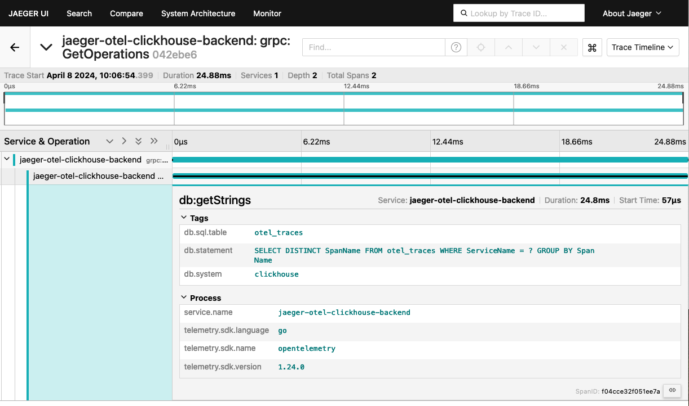

# Jaeger OpenTelemetry Clickhouse Backend 

This project is a Jaeger gRPC backend (v1) compatible with the [OpenTelemetry Clickhouse exporter](https://github.com/open-telemetry/opentelemetry-collector-contrib/tree/main/exporter/clickhouseexporter). It provides a way of visualizing trace data via the Jaeger Query frontend.



## Quickstart

Clone this repository and open a shell in the `examples` folder, then run:

```shell
docker-compose up
```
Access the Jaeger UI at [http://localhost:16686](http://localhost:16686).

On first load, there will be no traces, but that will cause the backend to create and send traces to the collector. On refresh, you should see the backend service in the UI.

## Config

Can be set by YAML file and the `-config` flag or by environment variable with the `JOCB` prefix.

| Env Var                             | YAML                           | Type   | Required | Default       | Example           |
|-------------------------------------|--------------------------------|--------|----------|---------------|-------------------|
| `JOCB_DB_HOST`                      | `db_host`                      | string | true     |               | `127.0.0.1`       |
| `JOCB_DB_PORT`                      | `db_port`                      | int    | true     |               | `9000`            |
| `JOCB_DB_USER`                      | `db_user`                      | string | true     | `default`     | `test_user`       |
| `JOCB_DB_PASS`                      | `db_pass`                      | string | false    |               | `test_pass`       |
| `JOCB_DB_NAME`                      | `db_name`                      | string | true     | `otel`        | `custom_database` |
| `JOCB_DB_TABLE`                     | `db_table`                     | string | true     | `otel_traces` | `trace_data`      |
| `JOCB_DB_CA_FILE`                   | `db_ca_file`                   | string | false    |               | `/ca.crt`         |
| `JOCB_DB_TLS_ENABLED`               | `db_tls_enabled`               | bool   | false    | `false`       | `true`            |
| `JOCB_DB_TLS_INSECURE`              | `db_tls_insecure`              | bool   | false    | `false`       | `true`            |
| `JOCB_DB_MAX_OPEN_CONNS`            | `db_max_open_conns`            | int    | false    |               | `10`              |
| `JOCB_DB_MAX_IDLE_CONNS`            | `db_max_idle_conns`            | int    | false    |               | `5`               |
| `JOCB_DB_CONN_MAX_LIFETIME_MILLIS`  | `db_conn_max_lifetime_millis`  | int    | false    |               | `3000`            |
| `JOCB_DB_CONN_MAX_IDLE_TIME_MILLIS` | `db_conn_max_idle_time_millis` | int    | false    |               | `1000`            |
| `JOCB_ENABLE_TRACING`               | `enable_tracing`               | bool   | false    | `false`       | `true`            |

### Tracing

The backend has been instrumented with OpenTelemetry and can be configured to export traces via gRPC to an OTLP compatible endpoint. This can be enabled using the `JOCB_ENABLE_TRACING=true` environment variable and setting `OTEL_EXPORTER_OTLP_ENDPOINT` to the desired OTLP compatible address.

## Tag Search Syntax

I took the liberty to enhance the tag search expressivity with wildcards and regex patterns.

### Wildcards

In the "Tags" field, using a `%` character will result in a wildcard match using SQL `LIKE` grammar. The following is an example of a tag query and the resulting SQL:

```sql
# http.url=http%://duckduckgo.com
  
SELECT ... WHERE SpanAttributes['http.url'] LIKE 'http%://duckduckgo.com'
```

### Regex

In the "Tags" field, using the operator `=~` character will result in a regex match using the Clickhouse [match](https://clickhouse.com/docs/en/sql-reference/functions/string-search-functions#match) function. The following is an example of a tag query and the resulting SQL:

```sql
# http.url=~http://[duck]+go.com
  
SELECT ... WHERE match(SpanAttributes['http.url'], 'http://[duck]+go.com')
```
